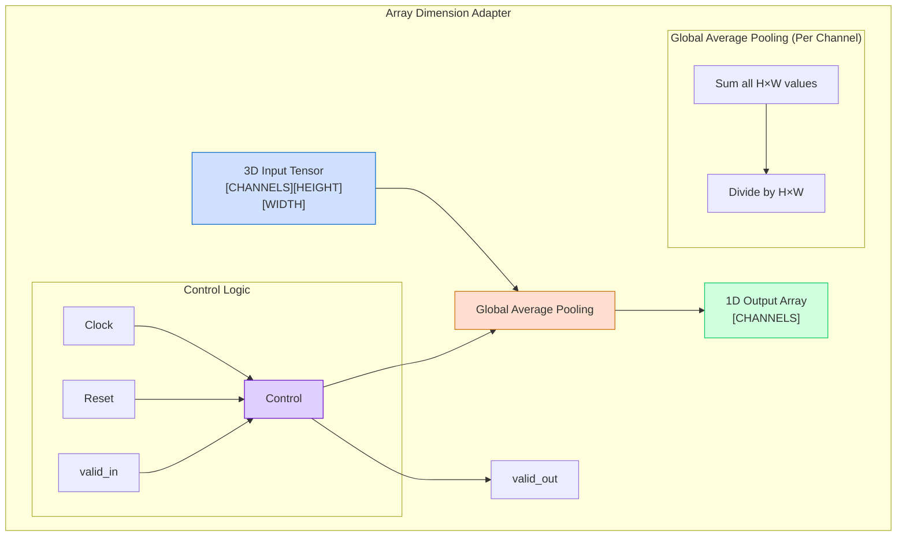

# Array Dimension Adapter: Block Diagram

## Detailed Data Flow

1. **Input**: 3D tensor with dimensions [CHANNELS][HEIGHT][WIDTH]
   - Each element is a DATA_WIDTH-bit value (typically 16-bit fixed point)
   - Example: [160][7][7] for final MobileNetV3 feature maps

2. **Processing**: Global Average Pooling
   - For each of the CHANNELS:
     - Sum all HEIGHT×WIDTH values (e.g., sum all 49 values in a 7×7 feature map)
     - Divide by HEIGHT×WIDTH (e.g., divide by 49)
   - Result is a single representative value per channel

3. **Output**: 1D array with dimension [CHANNELS]
   - Each element is the average value of the corresponding channel
   - Example: [160] for final MobileNetV3 feature vector

4. **Control Signals**:
   - Clock: Synchronizes all operations
   - Reset: Clears valid_out signal
   - valid_in: Indicates when input data is valid
   - valid_out: Indicates when output data is valid