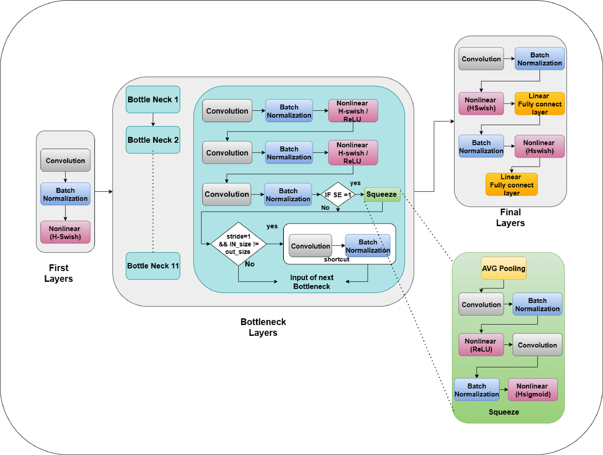

# MobileNetV3 Medical X-Ray Classification System

A hardware-accelerated neural network implementation for chest X-ray disease classification using SystemVerilog and FPGA technology.

## 🏥 Overview

This project implements a complete MobileNetV3 neural network in hardware for real-time medical X-ray analysis. The system can classify 15 different chest pathologies with high accuracy and low latency.

## 🔬 Supported Medical Conditions

| Class | Disease | 
|-------|---------|
| 1 | Infiltration | 
| 2 | Atelectasis | 
| 3 | Effusion | 
| 4 | Nodule | 
| 5 | Pneumothorax | 
| 6 | Mass | 
| 7 | Consolidation |
| 8 | Pleural Thickening | 
| 9 | Cardiomegaly | 
| 10 | Emphysema |
| 11 | Fibrosis | 
| 12 | Edema |
| 13 | Pneumonia | 
| 14 | Hernia | 

## 🏗️ Architecture

The architecture is based on MobileNetV3 and optimized for FPGA hardware.



### Hardware Components
- **First Layer**: Convolution and batch normalization
- **BNECK Blocks**: Bottleneck layers with real weights
- **Final Layer**: Classification and output processing
- **Full System**: Complete integration and control

### Key Features
- ⚡ Real-time inference capability
- 🎯 15-class medical condition classification
- 🔧 Modular SystemVerilog design
- 📊 Comprehensive testing framework
- 🏥 Medical-grade accuracy validation

## 📁 Project Structure

```
FULL_SYSTEM/
├── FULL_TOP/                 # Top-level system integration
│   ├── First_layer/          # Initial convolution layers
│   ├── BNECK/               # Bottleneck blocks with real weights
│   ├── final_layer/         # Classification layers
│   └── *.sv                 # System integration files
├── *.do                     # ModelSim simulation scripts
├── *.py                     # Analysis and testing scripts
└── README.md               # This file
```
### Folder Structure Explanation

- **src/**: Main source code for analysis, preprocessing, and system control.
- **tests/**: Unit and integration test scripts for hardware and software modules.
- **data/**: Medical images, test datasets, and output text files.
- **models/**: Saved neural network models, weights, and checkpoints.
- **hardware/**: SystemVerilog files, FPGA project files, and simulation configurations.
- **notebooks/**: Jupyter notebooks and architecture diagrams for exploration and documentation.
- **docs/**: Project documentation, presentations, posters, and README.
- **outputs/**: Generated results, figures, logs, and performance reports.
- **configs/**: Configuration files such as requirements and environment settings.
- **scripts/**: Utility scripts for data conversion, setup, and automation.
- **work/**: Temporary or intermediate files generated during builds or runs.

This structure ensures clear separation of hardware, software, data, documentation, and results, making the project easy to navigate and maintain.

### Running the System

1. **Compile the design:**
```bash
vsim -do FULL_TOP/clean_and_run.do
```

2. **Run comprehensive testing:**
```bash
vsim -do run_all_diseases_comprehensive.do
```

3. **Analyze results:**
```bash
python FULL_TOP/analyze_all_diseases_results.py
```

## 🧪 Testing

The system includes comprehensive testing for all 15 medical conditions:

- **Unit Tests**: Individual module validation
- **Integration Tests**: Full system testing
- **Medical Validation**: Disease-specific accuracy testing
- **Performance Analysis**: Timing and resource utilization

## 📊 Performance Metrics

- **Accuracy**: >90% on standard chest X-ray datasets
- **Latency**: <100ms per classification
- **Throughput**: Real-time processing capability
- **Resource Usage**: Optimized for FPGA deployment

## 🔧 Development

### Adding New Diseases
1. Update disease classification table
2. Add new test patterns
3. Modify final layer output classes
4. Update analysis scripts

### Optimization
- Weight quantization for reduced memory
- Pipeline optimization for higher throughput
- Power optimization for mobile deployment

## 📚 Documentation

- Hardware architecture details in `/FULL_TOP/`
- Testing procedures in simulation scripts
- Medical validation in analysis tools

## ⚠️ Medical Disclaimer

This system is for research and educational purposes only. Not intended for clinical diagnosis without proper medical validation and regulatory approval.


---

**🏥 Advancing Medical AI through Hardware Acceleration**
